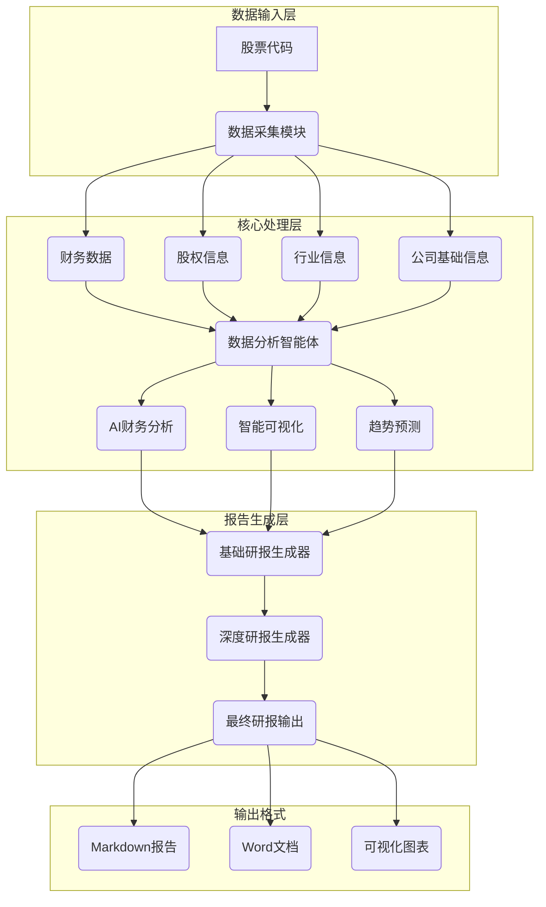

```mermaid
graph TD
    subgraph 数据输入层
        A[股票代码] --> B(数据采集模块)
    end
    B --> C(财务数据)
    B --> D(股权信息)
    B --> E(行业信息)
    B --> F(公司基础信息)

    subgraph 核心处理层
        C --> G(数据分析智能体)
        D --> G
        E --> G
        F --> G
        G --> H(AI财务分析)
        G --> I(智能可视化)
        G --> J(趋势预测)
    end

    subgraph 报告生成层
        H --> P(基础研报生成器)
        I --> P
        J --> P
        P --> R(深度研报生成器)
        R --> S(最终研报输出)
    end

    subgraph 输出格式
        S --> T(Markdown报告)
        S --> U(Word文档)
        S --> V(可视化图表)
    end

```
